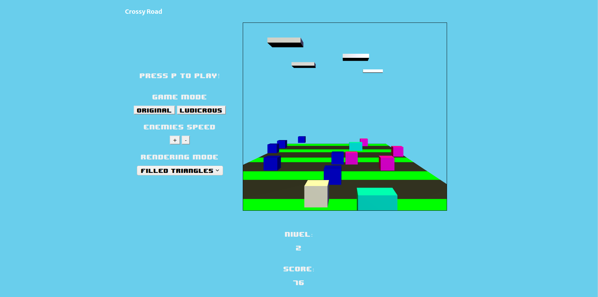

# crossy_roads_WebGL
WebGL Project - Visual Computation course

 

### Instructions:
* w - front
* s - back
* a - left
* d - right
* x - rotate camera to the left
* c - rotate camera to the right
* Alternatively you can click on the left/right side of the screen to move to the left/right respectively.
